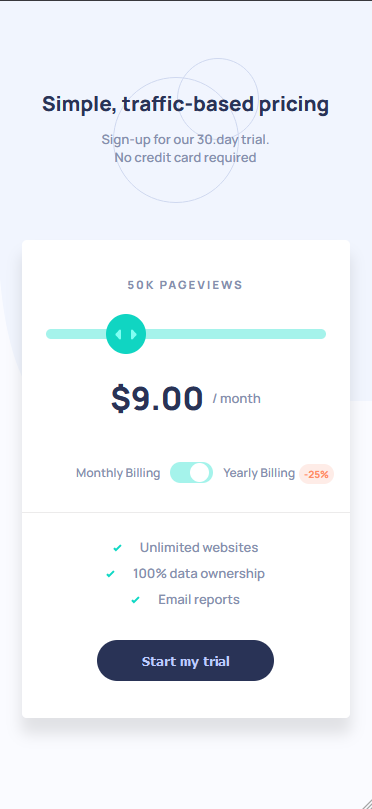
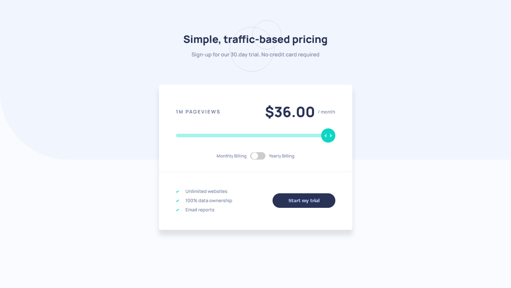
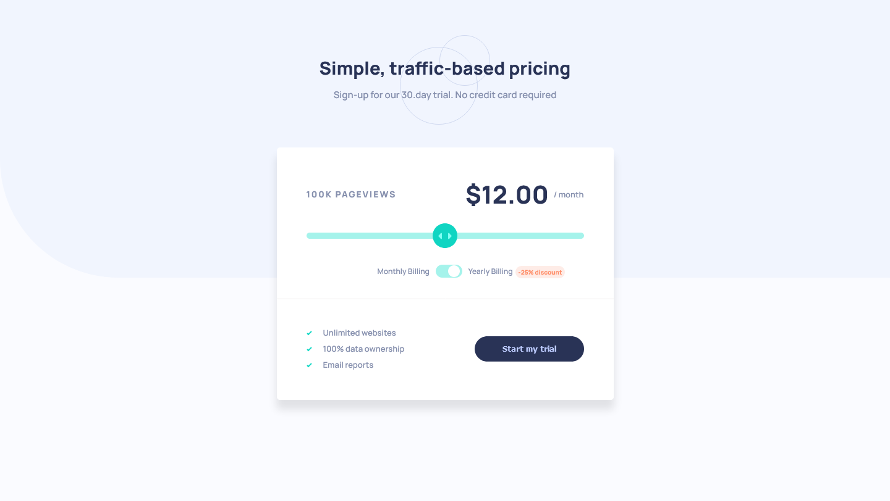

# Frontend Mentor Responsive HTML-CSS-JS- Interactive pricing component solution

This is a solution to the [Interactive pricing component challenge on Frontend Mentor](https://www.frontendmentor.io/challenges/interactive-pricing-component-t0m8PIyY8).

## Table of contents

- [Overview](#overview)
  - [The challenge](#the-challenge)
  - [Screenshot](#screenshot)
  - [Links](#links)
- [My process](#my-process)
  - [Built with](#built-with)
- [Author](#author)

## Overview

### The challenge

Users should be able to:

- View the optimal layout for the app depending on their device's screen size ✔
- See hover states for all interactive elements on the page ✔
- Use the slider and toggle to see prices for different page view numbers ✔

Here are the different page view ranges and the corresponding monthly price totals:

- 10K pageviews / $8 per month ✔
- 50K pageviews / $12 per month ✔
- 100K pageviews / $16 per month ✔
- 500k pageviews / $24 per month ✔
- 1M pageviews / $36 per month ✔

If the visitor switches the toggle to yearly billing, a 25% discount should be applied to all prices. ✔

### Screenshot

### Links

- Live Site URL: [Watch it live here](https://interactive-pricing-component-solution.vercel.app/)

## My process

### Built with

- Semantic HTML5 markup
- CSS custom properties
- Flexbox
- CSS Grid
- Mobile-first workflow

## Author

- Frontend Mentor - [@yourusername](https://www.frontendmentor.io/profile/yourusername)

